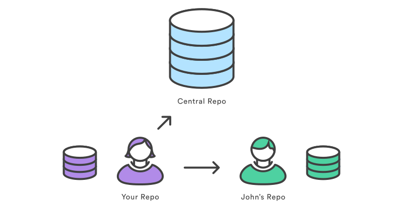
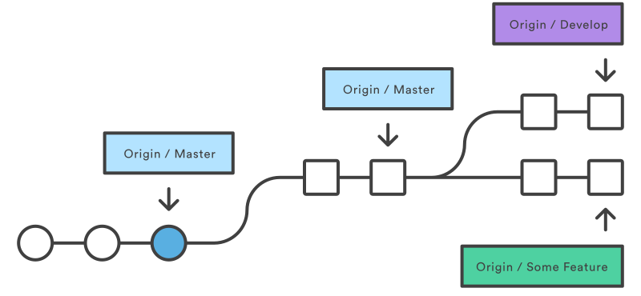
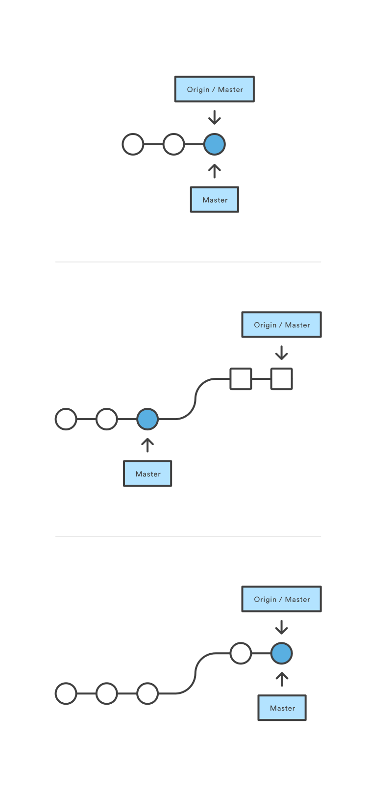

title: 协作同步
date: 2015-08-01
categories: [Git 魔导之路]
tags: [Git]
toc: true

---


SVN 使用一个单独的中心仓库以作为开发者的通信枢纽，其协作的方式是开发者的工作副本与中央仓库互相发送变更记录。这与 Git 的协作模式有所不同，Git 中每个开发者都拥有仓库的副本，以及完整的本地历史和分支结构。用户通常只需要提供一系列的提交而不是单个的变更记录。Git 允许我们在仓库之间共享整个分支，而不是单单的从工作副本提交一个变更记录到中央仓库去。

下面介绍的命令可以帮助我们管理与其他仓库的连接：我们可以使用“推送”分支的方式将本地历史发布到其他仓库，也可以使用“拉取”分支的方式将别人贡献的代码获取到本地。

<!--more-->

## git remote

`git remote` 命令让我们可以创建、查看和删除与其他仓库的链接。远端链接不是直接连到别的仓库，它更像是一个书签一样的快捷方式：它并没有提供与其他仓库的实时连接，而是提供了一个方便好记的别名以指代那些不那么方便的 URL。

比如下图就展示了从我们本地仓库链接到中央仓库和其他开发者仓库的两个链接。我们可以不用 URLs 全称来表示，而只用给其他的 Git 命令传递诸如 origin 和 john 这样的缩写就行。



### 使用

```bash
git remote
```

展示你与其他仓库之间的全部远端链接（仅有别名）。

```bash
git remote -v
```

与上条命令相同，不过带上了每个链接的 URL。

```bash
git remote add <name> <url>
```

创建一个连接到新远端仓库的链接。添加链接之后，我们就可以在其他的 Git 命令中方便地使用 `<name>` 作为指代 url 的简写。

```bash
git remote rm <name>
```

删除名为 `<name>` 的远端链接。

```bash
git remote rename <old-name> <new-name>
```

将一个名为 `<old-name>` 的链接重命名为 `<new-name>`

### 详述

Git 的设计初衷是给每一位开发者一个完整而独立的开发环境，这就意味着	信息不能自动的在库间传递。相反，开发者需要手动的将上游提交拉取到本地，或者手动的将本地提交推送会中央仓库。`git remote` 命令仅仅就是一个给那些带有“共享”性质的 Git 命令（**译者注：**如本文后面讲解的 `push` `pull` 命令等）传递 URL 的一个便捷方式。

#### origin 远端

当你使用 `git clone` 命令克隆一个仓库时，Git 会自动创建一个叫做 origin 的远程链接指向被克隆的仓库。这对开发者来说十分有益：当我们在本地创建一个中央仓库的副本时，可以便捷的推动本地提交或拉取远端修改。这也是大多数基于 Git 的项目管中央仓库叫“origin”的原因。

#### 仓库 URLs

Git 提供了许多方式以作为远端仓库的引用。两个最常用的方式就是通过 HTTP 协议和 SSH 协议。HTTP 是对仓库进行匿名且只有只读权限的访问的一条便捷方式，例如：

> http://host/path/to/repo.git

但是通常情况下给一个 HTTP 地址推送提交是不太可能的（我们应该也不会允许匿名用户推送提交）。我们应该使用 SSH 协议以获取读写权限：

> ssh://user@host/path/to/repo.git

我们在主机上需要有一个可用的 SSH 账号，除此之外，Git 也支持带有权限校验的访问（SSH 自带的）。

#### 示例

除了 origin 以外，连接同事的仓库也是十分方便的。例如你的好基友 John 维护着一个地址是 `dev.example.com/john.git` 公用仓库，你就可以这样添加一个链接：

```bash
git remote add john http://dev.example.com/john.git
```

通过这种到个人开发者仓库的连接方式，使中央仓库之外的协作成为可能。这对于小团队开发大项目来说十分有用。

## git fetch

`git fetch` 命令从远端仓库将提交导入到本地。导入的提交已然存储在远端分支而非我们工作的本地分支。这让我们在将远端提交整合到本地之前可以有机会审核一下代码。

### 使用

```bash
git fetch <remote>
```

拉取该仓库的全部分支，这一操作也会把所有必要的提交和文件都下载下来。

```bash
git fetch <remote> <branch>
```

和上一命令类似，但仅拉取特定的分支。

### 详述

当我们想查看其他人的工作时，可以采用 fetch 操作。既然 fetch 的参数代表着一个远端分支，那这一操作就对本地开发工作完全没有影响。fetch 为我们提供了一种不整合、先审核的安全的审核提交的方式。这有点像 svn update，它让我们看到中央仓库的历史情况，却不强制我们实际将更改并入本地仓库。

#### 远端分支

远端分支和本地分支很像，只不过远端包含了来自其他人仓库的提交。我们可以像查看本地分支一样查看远端分支，但是这会使我们的工程进入“分离头指针”的状态（正如检出到一个旧有提交的状态一样），我们可以将其当做一个只读的分支。想要查看远端分支，我们只需要给 `git branch` 命令加上一个 `-r` 参数。远端的分支会以远端的别名作为前缀，因此我们不会把它们和本地分支弄混。下面这个例子就展示了我们在获取 origin 的远端时可能看到的分支：

```bash
git branch -r
## origin/master
## origin/develop
## origin/some-feature
```

然后我们可以通过 `git checkout` 和 `git log` 的命令来检视这些分支。如果我们觉得一个远端分支的更改靠谱，就可以使用 `git merge` 命令将它整合到一个本地分支。与 SVN 不同的是，同步远端分支到本地的操作是 fetch 和 merge 两个过程。但 Git 却可以方便的使用 `git pull` 命令来完成这两个过程。

### 示例

这一示例展示了同步中央仓库的 `master` 分支到本地仓库这一典型工作流程。

```bash
git fetch origin 
```

这一步会展示已下载的分支们：

```bash
a1e8fb5..45e66a4 master -> origin/master
a1e8fb5..9e8ab1c develop -> origin/develop
* [new branch] some-feature -> origin/some-feature
```

从新的远端分支获取的提交们在下表中以方块显示，而之前在本地的提交以圆圈显示。如图所示， `git fetch` 使我们访问到另一个仓库的全部分支结构。

	

想查看上游的 master 分支添加了哪些提交，我们可以使用 `git log` 命令，并添加 `origin/master` 的过滤器。

```bash
git log --oneline master..origin/master
```

使用如下的命令可以将我们认可的分支合并到我们本地的 `master` 分支上：

```bash
git checkout master
git log origin/master	
```

之后我们便可以使用 `git merge` 命令合并 `origin/master`：

```bash
git merge origin/master
```

现在 origin/master 和本地的 master 分支都指向了同一提交，我们已经完成了与上游开发内容的同步。

## git pull

将上游更改合并到本地仓库在基于 Git 的协作工作流中是一个常见的操作。我们已经知道如何用 `git fetch` 和 `git merge` 来完成这一操作，但是 `git pull` 将这两部操作整合为一个命令。	

### 使用

```bash
git pull <remote>
```

这一命令表示获取制定的当前分支的远端副本并将其立即合并到本地副本中。这一命令与先 `git fetch <remote>` 然后 `git merge origin/<current-branch>` 效用相同。

```bash
git pull --rebase <remote>
```

和上一命令相同，不过不是使用 `git merge` 来整合远端分支，而是使用 `git rebase`。	

### 详述

我们可以把 `git pull` 理解成 `svn update` 的 Git 版本。这是一个将上游更改同步到本地仓库的快捷方式。下面的图解释了 pull 过程的每一步骤。



本来我们以为我们本地的仓库处于已同步状态，但是呢通过 `git fetch` 我们发现 origin 上的 master 在我们上次检查之后又有新的提交。于是 `git merge` 命令直接将远端 master 上的新内容整合到了本地。

#### 拉取和衍合

`--rebase` 参数可以用组织不必要提交的方式来保证线性提交历史。相比较合并，许多开发者更喜欢衍合一些，因为衍合的意思就像：“我想要将我的更改放在其他人的更改之上”。由于这个原因，在 `git pull` 时使用 `--rebase` 参数比不带衍合参数更像 `svn update` 一些。

实际上，使用 `--rebase` 参数拉取实在是太常用了，因此都有一个专用的配置项来配置它：

```bash
git config --global branch.autosetuprebase always
```

运行了上面的命令之后，所有的 `git pull` 命令就会自动通过 `git rebase` 而非 `git merge` 来进行分支整合。

### 示例

下例展示了如何从中央仓库的 master 分支上同步代码：

```bash
git checkout master
git pull --rebase origin
```

这就便捷的将我们本地的更改放在了其他人提交的代码的顶部。

## git push

推送就是我们将本地仓库的提交传送到远端仓库的方法。它是 `git fetch` 的反面：获取将提交引入本地分支，推送将提交导出到远端分支。推送本身可能会导致重写提交，因此我们在使用时还是要多加注意。这些内容下面会进行详细的讨论。

### 使用

```bash
git push <remote> <branch>
```

该命令表示将特定的分支 `<branch>` 中的所有必要的提交和内部对象推送到 `<remote>` 上。这一操作给目标仓库创造了一个本地分支。为了防止我们重写提交，当目标仓库处在**非快进合并状态**<sup>[注1][1]</sup>时，Git 是不允许我们提交的。

```bash
git push <remote> --force
```

和上面的命令相似，只不过即使没有处在快进合并状态时也可以强制提交。**不要**使用 `--force` 参数，除非你确切的知道自己在干啥。

```bash
git push <remote> --all
```

将所有本地分支提交到指定远端上。

```bash
git push <remote> --tags
```

在使用 `--all` 参数时也不会自动把**标签**<sup>[注2][2]</sup>提交上去的。 `--tags` 参数会将我们本地所有的标签提交到远端仓库中。

### 详述

`git push` 命令最常见的使用场景就是将本地的更改推送到中央仓库中。当我们已经积攒了一些本地提交并准备将其与团队中的其他同事分享这些提交时，我们可以先使用交互式的衍合修整我们的提交，然后将它们推送到中央仓库。


上图展示了当我们运行 `git push origin master` 时本地 `master` 分支和中央仓库的 `master` 分支之间发生了什么。注意 `git push` 命令在本质上与在远端仓库运行 `git merge master` 所产生的效果一致。

#### 强制推送

当中央仓库处在非快进合并状态时，Git 会阻止提交以防止我们覆盖中央仓库的历史记录。因此当远端历史与本地历史分离时，我们需要先拉取远端分支将其合并到本地上，然后再尝试推送。这与 SVN 在我们使用 `svn update` 提交变更集合之前先让我们与中央仓库同步的做法是一致的。

`--force` 参数改变了此行为而使远端仓库的分支匹配我们本地的分支，并会删除我们上次提交之后尚有分支的任何更改。我们唯一应该使用强制推送的场景是当我们意识到我们之前推送的提交是有问题的，并使用 `git commit --amend` 或交互式衍合来更改了这一提交。然而我们在进行强制推送之前，也必须确认这期间没有同事拉取了我们之前的提交。

#### 只推送到裸仓库

再就是我们应该仅往使用 `--bare` 参数创建的裸仓库进行推送。由于推送会弄乱远端分支结构，因此千万不要推送到其他开发者的仓库去。但是由于裸仓库没有工作目录，因此并不会扰乱其他人的开发。

### 示例

下例展示了一种将本地开发推送到中央仓库的一种标准方法。首先，要获取中央仓库的副本并将更改衍合到顶部，以确保我们本地 `master` 分支是**最新的（up-to-date）**。使用交互式衍也是在推送提交前进行清理的一个好选择。之后，使用 `git push` 命令将所有本地 `master` 分支上的提交推送到中央仓库。

```bash
git checkout master
git fetch origin master
git rebase -i origin/master
## 进行压缩提交，修改提交信息等工作
git push origin master
```

由于我们已经确保本地 `master` 分支是最新的，因此推送会导致一个快进合并，使用 `git push` 命令也不必抱怨哪些之前提到的非快进合并状态的问题。


---

**译注**

- <b id="note-1">注1</b> **非快进合并状态（non-fast-forward merge）**：与快进状态相对立，按 Git Pro 书上的[解释](http://iissnan.com/progit/html/zh/ch3_2.html)：

> 如果顺着一个分支走下去可以到达另一个分支的话，那么 Git 在合并两者时，只会简单地把指针右移，因为这种单线的历史分支不存在任何需要解决的分歧，所以这种合并过程可以称为快进（Fast forward）

因此非快进合并状态即是指当要合并的分支不是在当前分支的上游，提交出现分岔的状态。

- <b id="note-2">注2</b> **标签**：再发布版本的时候打上标签标记，是 VCS 的通用方法。详见 Git Pro [打标签](http://iissnan.com/progit/html/zh/ch2_6.html)一章。

[1]: #note-1
[2]: #note-2


